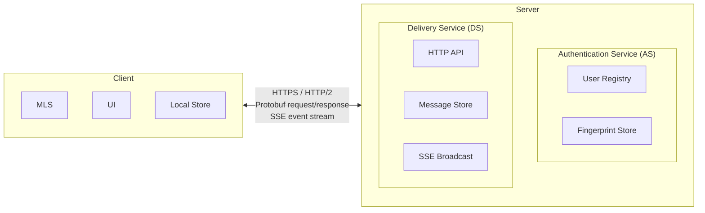

# Architecture Overview

## System Model

Conclave uses a client-server architecture with MLS running on top of HTTP/2.

Each Conclave deployment consists of a single server and one or more clients. There is no server-to-server federation protocol — each server is an isolated community. All communication uses standard HTTP/2 with protobuf encoding and SSE for real-time events, making the server compatible with reverse proxies and CDNs.

## Service Roles

RFC 9420 Section 3 defines two external services that every MLS deployment must provide: an **Authentication Service (AS)** that authenticates the credentials presented by group members, and a **Delivery Service (DS)** that routes MLS messages among participants. Conclave's server provides both in a single process.

**Authentication Service (AS)** — The AS is the trusted, authoritative registry that binds user identities to MLS credentials. It handles:

- **User registration and authentication**: Creating accounts, verifying passwords, issuing session tokens.
- **Signing key fingerprint storage and distribution**: Storing each user's MLS signing key fingerprint and distributing it to other members via group member lists and user lookup endpoints.
- **Access control**: All MLS operations (key package upload, group creation, messaging) require bearer-token authentication, ensuring only the registered owner of a `user_id` can publish credentials for that identity.

Clients complement the server-side AS with [TOFU fingerprint verification](../mls/tofu.md) to detect post-first-contact key changes.

**Delivery Service (DS)** — The DS is untrusted with respect to message content. MLS guarantees confidentiality and integrity regardless of DS behavior. It handles:

- **Message storage and forwarding**: Storing opaque MLS ciphertext blobs and returning them to clients on request.
- **Key package storage**: Holding pre-published MLS key packages for asynchronous group additions.
- **Group metadata**: Tracking group membership, roles, and MLS GroupInfo for external joins.
- **Escrowed invite materials**: Storing pre-built MLS commits and Welcomes for the two-phase invite system.
- **Real-time push**: Broadcasting events to connected clients via Server-Sent Events (SSE).
- **Retention enforcement**: Periodically deleting expired messages based on server-wide and per-group policies.

The trust asymmetry between these services is important: a compromised DS cannot read message contents or forge messages, but a compromised AS can substitute credentials for new contacts before TOFU fingerprints are stored. See [Server Compromise](../security/threats.md#threat-server-compromise) for the full threat analysis.

## Component Roles

### Server

The server is a stateless relay for encrypted MLS messages. Its responsibilities are divided between the Authentication Service and Delivery Service as described above.

The server MUST NOT attempt to decrypt, interpret, or validate the contents of MLS messages. All MLS data (key packages, commits, welcomes, application messages) are treated as opaque byte blobs.

### Client

A Conclave client is responsible for:

- **MLS operations**: All cryptographic operations (key generation, encryption, decryption, group management) run on the client.
- **API communication**: Sending protobuf-encoded HTTP requests to the server and processing responses.
- **SSE consumption**: Maintaining a persistent connection to the server's event stream for real-time notifications.
- **Local state**: Persisting MLS group state, signing keys, message history, and session information.
- **Name resolution**: Resolving integer IDs to human-readable display names using the local member cache or server lookup endpoints.
- **Identity verification**: Managing the local TOFU fingerprint store for signing key verification.

Clients MAY implement any user interface (terminal, graphical, headless bot, etc.) as long as they conform to this specification's API and MLS requirements.

## Data Model

The server maintains the following logical entities:

### Users

Each user has:

- A unique integer ID (`user_id`), auto-assigned at registration.
- A unique `username` (ASCII alphanumeric + underscores, 1–64 characters).
- An optional `alias` (display name, up to 64 characters).
- A password hash (Argon2id).
- A `signing_key_fingerprint` (SHA-256 hex of the MLS signing public key, uploaded by the client).

### Sessions

Each session has:

- An opaque bearer `token` (256-bit random, hex-encoded).
- An associated `user_id`.
- A creation timestamp and expiry time.

### Groups

Each group has:

- A unique integer ID (`group_id`), auto-assigned at creation.
- A unique `group_name` (same format as username).
- An optional `alias` (display name).
- An `mls_group_id` (hex-encoded MLS opaque group identifier, set on first commit).
- A `message_expiry_seconds` setting (-1 = disabled, 0 = delete-after-fetch, >0 = seconds).

### Group Members

Each membership record has:

- A `group_id` and `user_id` pair (composite primary key).
- A `role`: either `"admin"` or `"member"`.

### Messages

Each stored message has:

- A `group_id` identifying the containing group.
- A `sender_id` identifying the sending user.
- An `mls_message` blob (opaque MLS ciphertext).
- A `sequence_num` (unique within the group, monotonically increasing).
- A `created_at` timestamp (Unix epoch seconds).

### Key Packages

Each key package has:

- An associated `user_id`.
- A `key_package_data` blob (opaque MLS key package bytes).
- An `is_last_resort` flag.

### Pending Invites

Each pending invite holds the escrowed MLS materials for a two-phase invitation:

- A `group_id` and `invitee_id` pair (unique constraint).
- The `inviter_id`.
- The `commit_message`, `welcome_data`, and `group_info` blobs.

### Pending Welcomes

Each pending welcome holds an MLS Welcome message ready for the target user to process:

- A `group_id` and `user_id`.
- The `welcome_data` blob.

### Group Info

Each group may have a stored MLS GroupInfo blob, used for external commits (account reset / rejoin). Updated by commit upload, member removal, and group departure operations.
