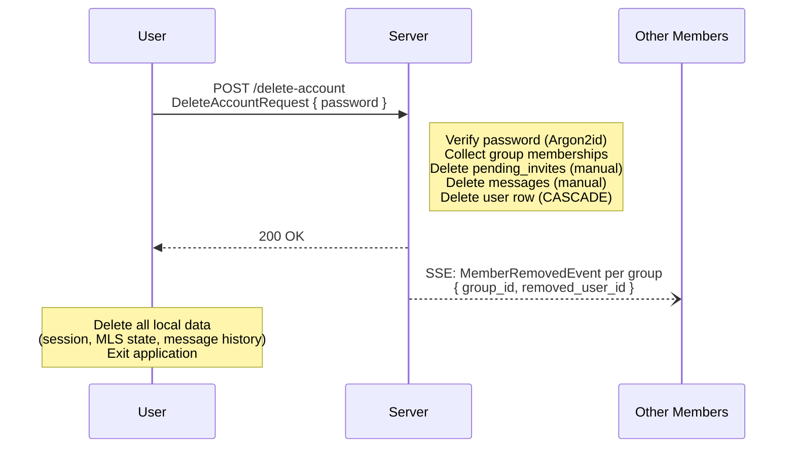

# Account Deletion

## Overview

A user can permanently and irreversibly delete their account using the `/expunge` command. This removes all server-side data associated with the user. The client then wipes all local data and exits.

## Steps

1. **Password verification**: The server verifies the provided password against the stored Argon2id hash. This confirms the user's intent for this irreversible operation.

2. **Collect group memberships**: Before deleting data, the server collects all groups the user belongs to and their member lists. This information is needed to send SSE notifications after deletion.

3. **Delete user data**: In a savepoint transaction, the server:
   - Deletes all `pending_invites` where the user is either inviter or invitee (no ON DELETE CASCADE on these foreign keys).
   - Deletes all `messages` where the user is the sender (no ON DELETE CASCADE on this foreign key).
   - Deletes the `users` row. CASCADE handles the remaining tables: `sessions`, `key_packages`, `group_members`, `pending_welcomes`, `message_fetch_watermarks`.

4. **Broadcast notifications**: The server broadcasts a `MemberRemovedEvent` for each group the user belonged to, sent to all remaining members of that group.

5. **Client cleanup**: On receiving a successful response, the client:
   - Deletes all local data in the user's data directory (session, MLS state, message history, group mappings).
   - Clears all in-memory state.
   - Exits the application (TUI) or returns to the login screen (GUI).

## MLS Implications

Remaining group members will have phantom MLS leaves for the deleted user. No MLS removal commits are generated — this is a server-side-only deletion. Other members can use `/rotate` to advance the epoch and clean up the MLS tree state.

## Remaining Members

When a client receives a `MemberRemovedEvent` for a deleted user:

1. Refresh the member list via `load_rooms()`.
2. The MLS tree is not automatically updated — the phantom leaf persists until the next key rotation or external commit.
