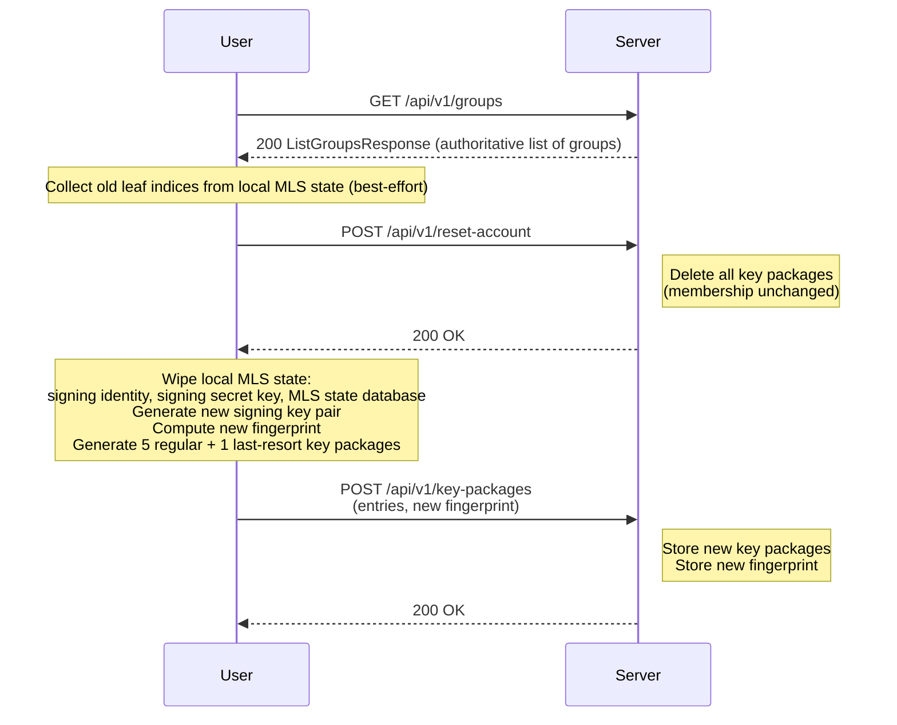
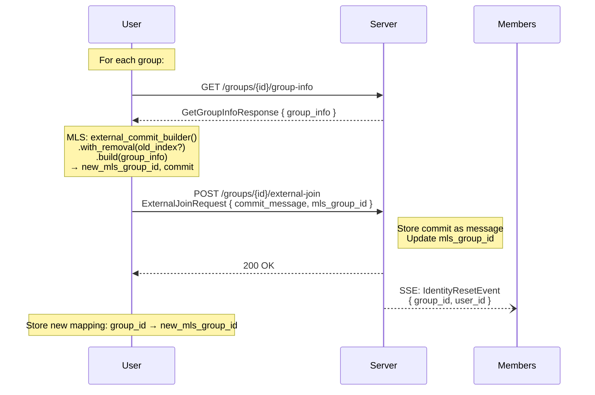

# Account Reset and External Rejoin

## Overview

An account reset allows a user to regenerate their MLS cryptographic identity and rejoin all their groups with fresh key material. This is used when:

- The user's local MLS state is corrupted or lost.
- The user suspects their signing key has been compromised.
- The user wants to rotate their long-lived signing key.

After a reset, the user has a new signing key pair, a new fingerprint, and fresh MLS group state for all groups. Other group members are notified and will see a key change warning.

## Account Reset Flow

### Steps 1–4: Reset Identity

1. **Fetch group list**: The client fetches the authoritative group list from the server. This is the source of truth for which groups the user belongs to (local state may be incomplete).

2. **Collect old leaf indices**: For each group, the client attempts to find its own leaf index in the local MLS state. This is best-effort — if local state is corrupted or missing, the old index may not be available.

3. **Server reset**: The client calls `POST /api/v1/reset-account`. The server deletes all of the user's key packages. Group membership is NOT affected.

4. **Regenerate identity**: The client wipes all local MLS state (signing identity, signing key, MLS database) and generates a completely new signing key pair. New key packages are generated and uploaded with the new fingerprint.

## Group Rejoin Flow

After resetting the identity, the client must rejoin each group via MLS external commits:

### Steps 5–7: Rejoin Groups

5. **Fetch GroupInfo**: For each group, the client fetches the stored MLS GroupInfo. This provides the public group state needed for the external commit.

6. **Build external commit**: The client builds an MLS external commit (RFC 9420 Section 12.3.2) to join the group with its new identity:
   - If the old leaf index is known, the external commit includes a self-removal proposal to remove the stale leaf.
   - If the old leaf index is unknown, the external commit adds the new identity without removing the old one. The old leaf becomes an unreachable phantom and will be cleaned up when another member processes the commit.

7. **Upload external join**: The client uploads the external commit. The server stores it as a group message and broadcasts an `IdentityResetEvent` to other members.

### Error Handling

Each group rejoin is attempted independently. If a rejoin fails (e.g., no GroupInfo available, MLS error), the client SHOULD continue with other groups and report the failures. Common error scenarios:

- **No GroupInfo available (404)**: The group has no stored GroupInfo. This happens if no commits, removals, or leaves have occurred since the group was created. The user cannot rejoin this group without another member uploading fresh GroupInfo.
- **DuplicateLeafData**: The MLS library may reject the external commit if the new identity collides with existing leaf data. The client SHOULD retry with the conflicting leaf index specified in the removal.

## Other Members' Perspective

When a user resets their account and rejoins via external commit:

1. Other members receive `IdentityResetEvent` via SSE.
2. Members fetch the external commit from the message stream and process it through MLS. The MLS tree is updated with the user's new leaf.
3. The user's signing key fingerprint has changed. Other clients detect this via the [TOFU verification system](../mls/tofu.md) and display a `[!]` warning next to the user's name.
4. Members SHOULD verify the new fingerprint out-of-band (e.g., via `/verify`) to confirm the reset was legitimate.
