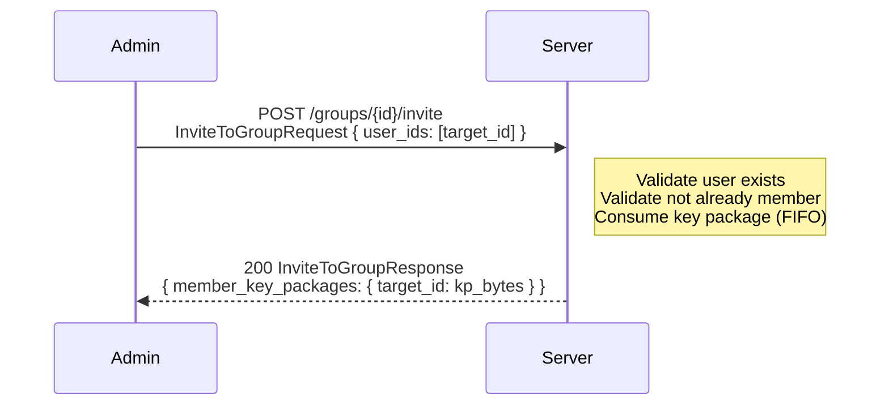
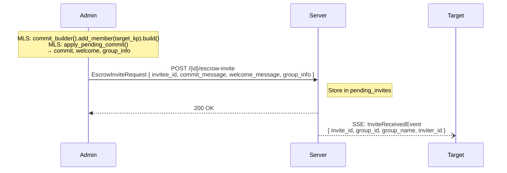
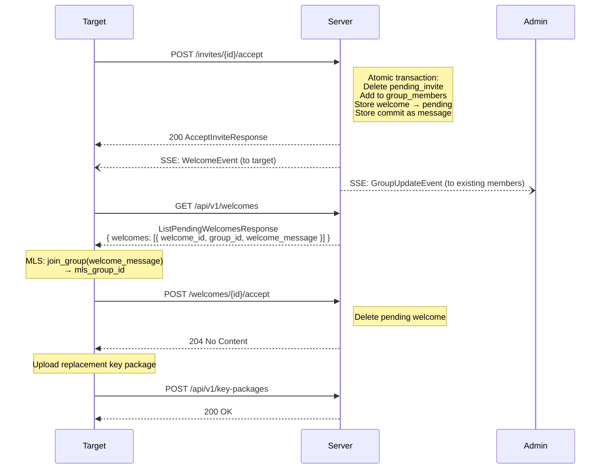
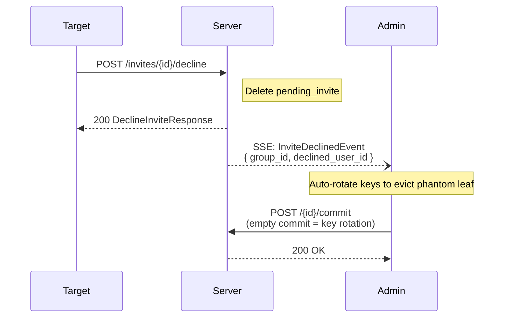
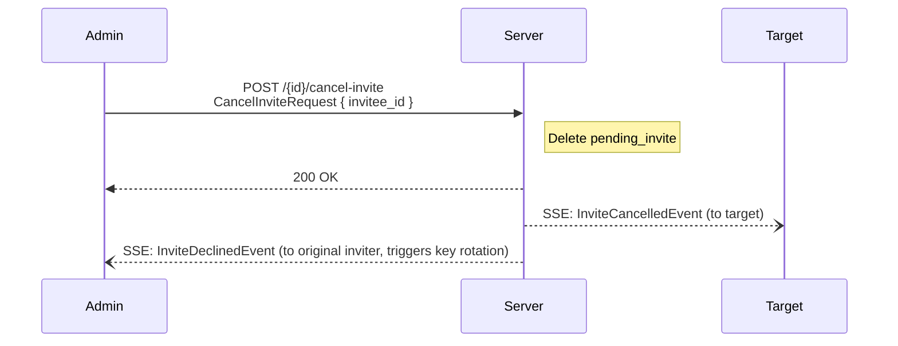

# Escrow Invite System

## Overview

Conclave uses a **two-phase escrow invite system** for all post-creation member additions. This system requires the target user to explicitly accept or decline an invitation before being added to a group. This prevents invite spam and gives users control over which groups they join.

The system works by having the inviter pre-build the MLS commit and Welcome message, then uploading them to the server for escrow. The target can inspect the invitation and choose to accept (triggering group join) or decline (discarding the escrowed materials and triggering phantom leaf cleanup).

## Full Invite Flow

### Phase 1: Key Package Consumption

The admin requests key packages for the target users. The server validates each user, checks they are not already group members, and returns one consumed key package per user.

### Phase 2: Escrow

The admin builds the MLS commit (which adds the target as a new leaf) and the corresponding Welcome message. These are uploaded to the server's invite escrow along with the updated GroupInfo.

At this point, the admin's local MLS group state has already advanced — the target appears as a member in the admin's MLS tree. However, the target has not yet joined and the server has not yet added them to the group membership.

The target receives an `InviteReceivedEvent` via SSE.

### Phase 3a: Accept Path

When the target accepts:

1. The server atomically: deletes the pending invite, adds the target to group members, stores the escrowed Welcome as a pending welcome, and stores the escrowed commit as a group message.
2. The target fetches and processes the Welcome message through the MLS layer to join the group.
3. The target acknowledges the Welcome and uploads a replacement key package.

### Phase 3b: Decline Path

When the target declines:

1. The server deletes the pending invite and the escrowed materials.
2. The inviter receives an `InviteDeclinedEvent` via SSE.
3. The inviter's client automatically performs a key rotation (empty MLS commit) to evict the phantom leaf that was added to the MLS tree during phase 2.

### Invite Cancellation

An admin can cancel a pending invite:

Cancellation triggers the same phantom leaf cleanup as declining: the original inviter receives an `InviteDeclinedEvent` and performs a key rotation.

## Constraints

- A user MUST NOT have more than one pending invite per group. The server enforces a unique constraint on `(group_id, invitee_id)`.
- Pending invites have a configurable TTL (default 7 days). Expired invites are cleaned up by the server's background task.
- The inviter MUST be an admin of the group.
- The invitee MUST exist and MUST NOT already be a group member.

## Phantom Leaf Problem

When the admin builds the MLS commit during phase 2, the MLS group state advances locally — the target appears as a new leaf in the MLS tree. If the target declines (or the invite is cancelled), this leaf is "phantom": it exists in the MLS tree but the user never actually joined.

The phantom leaf MUST be cleaned up via key rotation (an empty commit that advances the epoch). This is triggered automatically when the inviter's client receives an `InviteDeclinedEvent`.

If the phantom leaf is not cleaned up, subsequent MLS operations may fail or produce unexpected behavior, as the MLS tree contains a member who cannot participate in the group.
