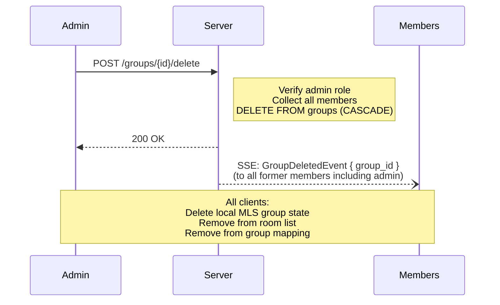

# Group Deletion

## Overview

A group admin can permanently delete a group using the `/delete` command. This removes the group and all associated data from the server. All members receive a `GroupDeletedEvent` and clean up their local state.

## Steps

1. **Admin verification**: The server verifies the caller is an admin of the group.

2. **Collect members**: The server collects all group members before deletion for SSE notification targeting.

3. **Delete group**: The server executes `DELETE FROM groups WHERE id = ?`. CASCADE handles all dependent tables: `group_members`, `messages`, `pending_invites`, `pending_welcomes`, `message_fetch_watermarks`.

4. **Broadcast**: The server broadcasts a `GroupDeletedEvent` to all former members, including the admin who performed the deletion.

## Client Behavior

When a client receives a `GroupDeletedEvent`:

1. Delete local MLS group state for the group (`delete_mls_group_state`).
2. Remove the group from the local room list.
3. Remove the group from the group ID mapping.
4. If the deleted group was the active room, deactivate it.
5. Display a system message indicating the group was deleted.
