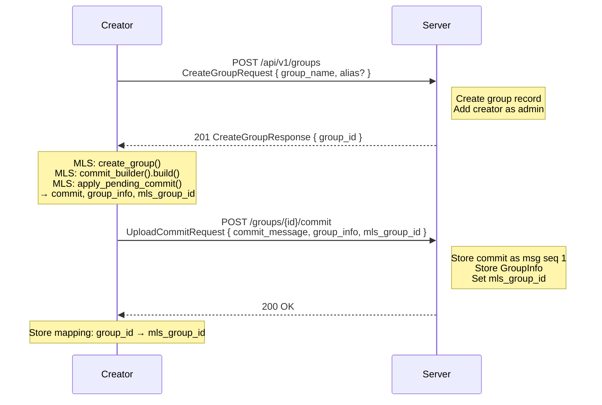
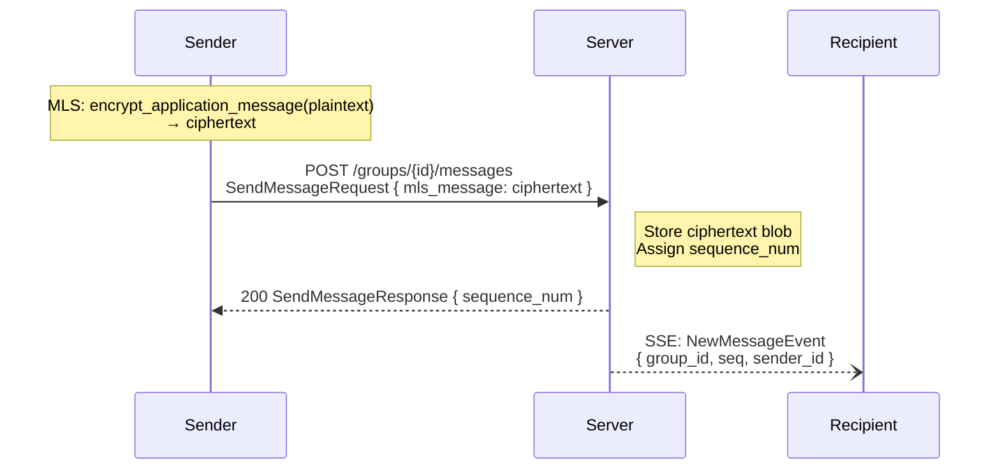
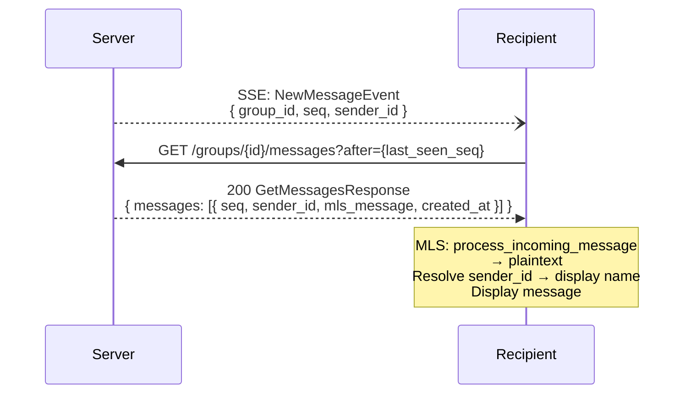

# Group Creation and Messaging

## Group Creation Flow

Creating a group involves a server-side operation followed by MLS group initialization.

### Steps

1. **Create on server**: The client sends the group name and optional alias. The server creates the group record and adds the creator as the sole member with the `admin` role.

2. **Initialize MLS group**: The client creates an MLS group locally. The initial MLS group has only the creator. The client builds an initial commit (which establishes the group's cryptographic state) and extracts the GroupInfo.

3. **Upload commit**: The client uploads the commit, GroupInfo, and the hex-encoded MLS group ID. The commit is stored as the first message (sequence number 1). The `mls_group_id` is recorded in the group's server record.

4. **Store mapping**: The client stores the mapping from the server's `group_id` to the MLS `mls_group_id` for future operations.

## Sending a Message

### Steps

1. **Encrypt**: The client encrypts the plaintext message using MLS, producing an opaque ciphertext blob.

2. **Send**: The client sends the ciphertext to the server. The server stores it as an opaque blob and assigns a monotonically increasing sequence number.

3. **Notify**: The server broadcasts a `NewMessageEvent` to all group members except the sender, indicating that a new message is available.

## Receiving Messages

### Steps

1. **Receive notification**: The client receives a `NewMessageEvent` via SSE, indicating a new message is available in a group.

2. **Fetch messages**: The client fetches messages with sequence numbers after its last known sequence number using the `after` query parameter.

3. **Decrypt**: For each message, the client processes it through the MLS layer:
   - **Application messages** produce decrypted plaintext (chat messages).
   - **Commit messages** produce roster change information (members added/removed, key rotations).
   - **Failed decryption** produces an error reason (epoch evicted, key missing, etc.).

4. **Resolve sender**: The client maps the `sender_id` to a display name using its local member cache or the user lookup endpoint.

5. **Update tracking**: The client updates its last-seen sequence number to avoid re-fetching processed messages.

## Commit Messages vs. Application Messages

Both commits and application messages are stored in the same message table with sequential sequence numbers. The client distinguishes between them during MLS decryption:

- **Application messages**: `process_incoming_message()` returns decrypted plaintext bytes. These are user-visible chat messages.
- **Commit messages**: `process_incoming_message()` returns a commit result with information about roster changes (members added, members removed). Clients typically display these as system messages (e.g., "Alice joined the group", "Group keys updated").

An empty commit (no proposals, just epoch advancement) indicates a key rotation for forward secrecy.
