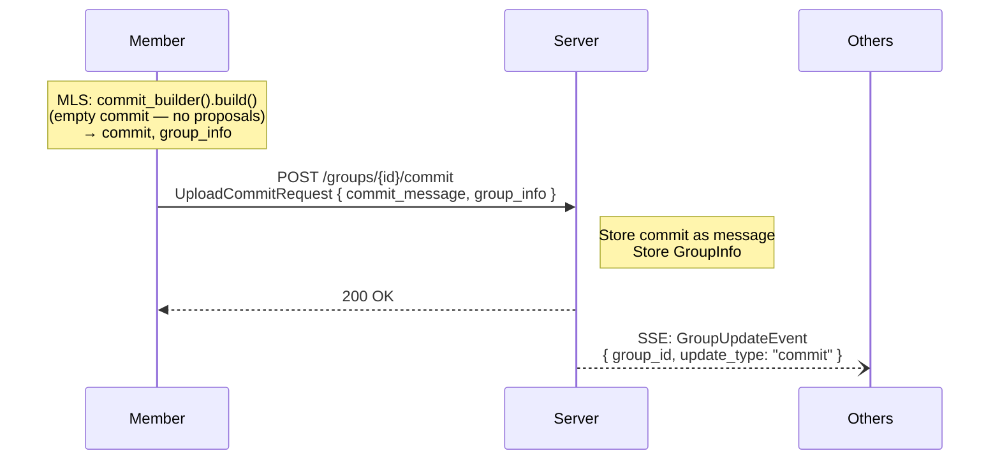

# Key Rotation

## Overview

Key rotation is the process of advancing a group's MLS epoch by building an empty commit (a commit with no proposals). This provides **forward secrecy**: after the epoch advances, the old key material is discarded and cannot be used to decrypt future messages.

## Key Rotation Flow

### Steps

1. **Build empty commit**: The client builds an MLS commit with no proposals. This advances the epoch and rotates the group's key material.

2. **Upload commit**: The client uploads the commit and updated GroupInfo to the server.

3. **Notify**: The server broadcasts a `GroupUpdateEvent` with `update_type: "commit"` to all group members except the sender.

4. **Process commit**: Other members fetch the commit via the messages endpoint and process it through MLS. The epoch advances and key material is rotated.

## When Key Rotation Occurs

### After Declined Invite (Phantom Leaf Cleanup)

When an admin invites a user to a group (via the [escrow invite system](escrow-invite.md)), the admin's MLS group state immediately advances — the invitee appears as a new leaf in the MLS tree. If the invitee declines the invite, this leaf becomes a phantom: it exists in the MLS tree but the user never actually joined.

When the admin receives an `InviteDeclinedEvent`, the client SHOULD automatically perform a key rotation to evict the phantom leaf. The empty commit advances the epoch and cleans up the stale tree state.

This also applies when an admin cancels a pending invite — the original inviter receives an `InviteDeclinedEvent` and SHOULD perform the same key rotation.

### Explicit User Command

Users may explicitly request key rotation (e.g., via a `/rotate` command) to achieve forward secrecy at will. This is useful after sensitive discussions or when a user suspects their session may have been compromised.

### Periodic Rotation (Optional)

Client implementations MAY implement periodic automatic key rotation as a policy. However, frequent rotation increases the rate of epoch advancement, which can cause decryption failures for offline members who exceed the epoch retention limit.

## Forward Secrecy Properties

After a key rotation:

- Messages encrypted under previous epochs cannot be decrypted by anyone who obtains the current epoch's key material.
- The old key material is discarded from the MLS state (subject to the epoch retention limit).
- Any compromise of current keys does not reveal past messages.

## Impact on Offline Members

Key rotation advances the epoch. Offline members must retain key material for prior epochs to decrypt messages sent during those epochs. If a member's epoch retention limit (recommended: 16 epochs) is exceeded, they will be unable to decrypt messages from evicted epochs.

Frequent key rotation should be balanced against the risk of epoch exhaustion for offline members.
