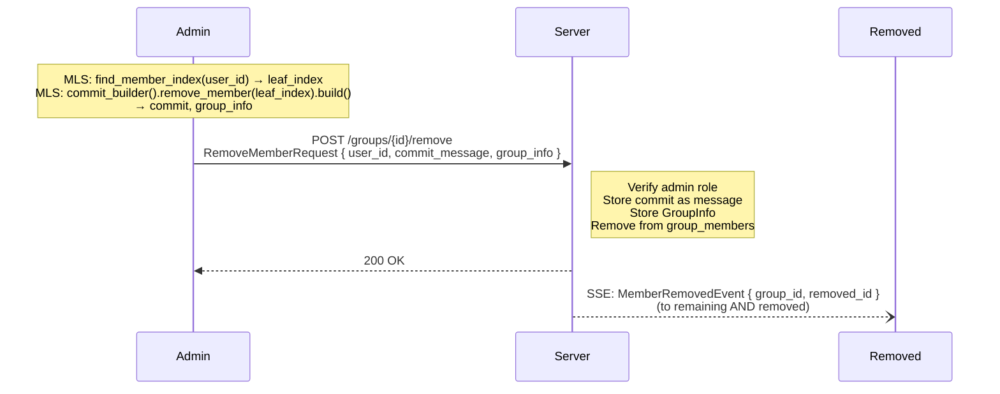
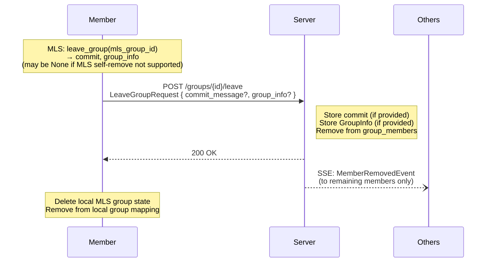

# Member Removal and Departure

## Admin Removal (Kick)

An admin can remove a member from a group. This involves both an MLS commit (to remove the member from the MLS tree) and a server-side membership update.

### Steps

1. **Find member index**: The admin's client scans the local MLS group tree to find the target user's leaf index by matching the `user_id` embedded in their `BasicCredential`.

2. **Build removal commit**: The admin builds an MLS commit with a Remove proposal targeting the member's leaf index. This produces a commit message and updated GroupInfo.

3. **Upload removal**: The admin sends the removal request to the server with the user ID, commit message, and GroupInfo. The server:
   - Verifies the requester is an admin.
   - Stores the commit as a group message (assigned the next sequence number).
   - Stores the updated GroupInfo (for potential external rejoin).
   - Removes the target from the group membership table.

4. **Notify**: The server broadcasts a `MemberRemovedEvent` to all remaining members AND the removed user.

### Client Behavior — Remaining Members

When a client receives a `MemberRemovedEvent` where `removed_user_id` does not match their own user ID:

1. Fetch new messages (including the removal commit) via `GET /groups/{id}/messages`.
2. Process the commit through MLS to advance the group epoch.
3. Refresh the member list.

### Client Behavior — Removed User

When a client receives a `MemberRemovedEvent` where `removed_user_id` matches their own user ID:

1. Remove the group from the local display.
2. Delete the local MLS group state for that group.

---

## Voluntary Departure (Leave)

A member can voluntarily leave a group. The flow is similar to admin removal, but the member removes themselves.

### Steps

1. **Build self-removal commit**: The client attempts to build an MLS self-removal commit. If the MLS library does not support self-removal, the commit fields may be empty.

2. **Send leave request**: The client sends the leave request with the optional commit and GroupInfo. The server:
   - Stores the commit as a group message if provided.
   - Stores the GroupInfo if provided (for external rejoin by other members).
   - Removes the user from the group membership table.

3. **Clean up locally**: The client deletes its local MLS group state for the group and removes it from the group mapping.

4. **Notify**: The server broadcasts a `MemberRemovedEvent` to remaining members only (the departing user does NOT receive it).

### Remaining Members

Remaining members process the leave commit through MLS (if one was provided) to advance the group epoch and update the MLS tree.
