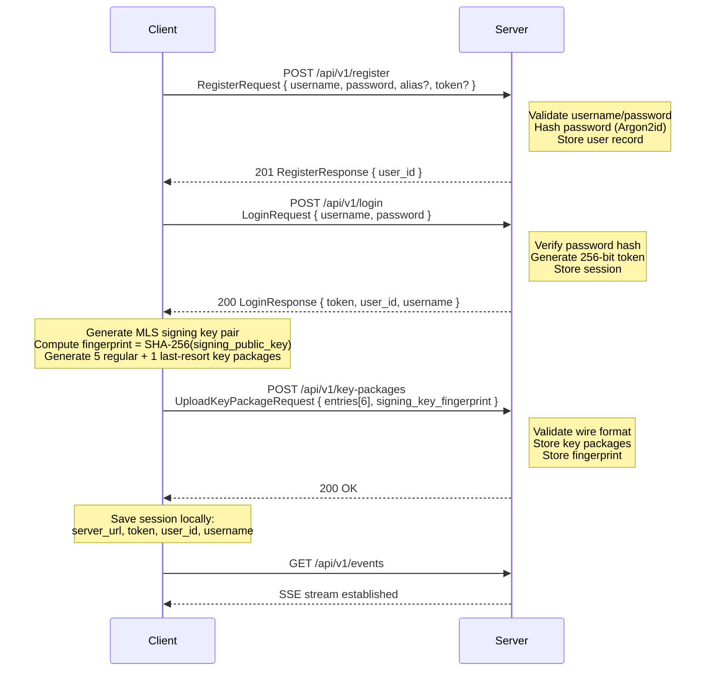
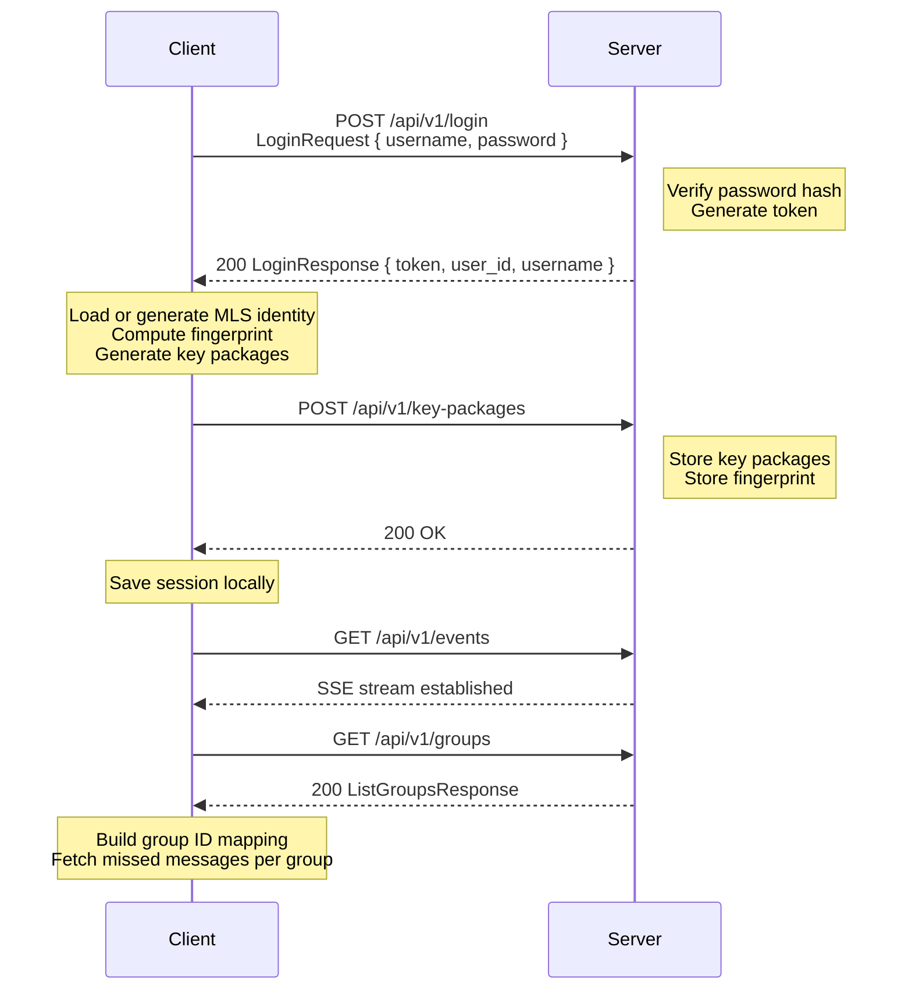

# Registration and Login

## Registration Flow

Registration creates a new user account, establishes an MLS identity, and uploads initial key packages.

### Steps

1. **Register**: The client sends the username, password, optional alias, and optional registration token. The server validates input, hashes the password, and creates the user record.

2. **Login**: The client immediately logs in after registration. The server verifies the password, generates a session token, and returns it with the user ID.

3. **Generate MLS identity**: The client generates an Ed448 signing key pair (part of the CURVE448_CHACHA cipher suite). The signing identity and secret key are persisted locally.

4. **Compute fingerprint**: The client computes `SHA-256(signing_public_key)` and formats it as a 64-character lowercase hex string.

5. **Upload key packages**: The client generates 5 regular and 1 last-resort key packages, then uploads them to the server along with the signing key fingerprint.

6. **Save session**: The client persists the server URL, token, user ID, and username locally for future requests.

7. **Connect SSE**: The client opens a persistent SSE connection for real-time event notifications.

## Login Flow

Login follows the same sequence as registration, except step 1 (register) is skipped:

On login, clients SHOULD:

1. Load the existing MLS identity if available, or generate a new one.
2. Upload fresh key packages (replenishing any that were consumed while offline).
3. Fetch the group list to rebuild the server-group-ID to MLS-group-ID mapping.
4. Fetch any missed messages for each group (using the locally stored last-seen sequence number).
