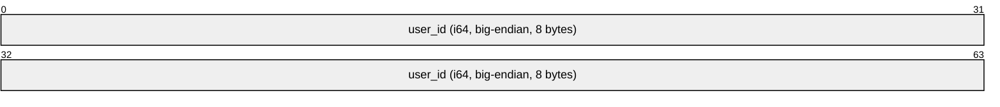

# Identity and Credentials

## MLS Credentials

Conclave uses MLS `BasicCredential` for all group members. The credential contains the user's identity data, which is embedded in their key packages and used by other group members to identify the sender of messages and commits.

### Credential Format

The `BasicCredential` identity field contains the user's `user_id` encoded as a **big-endian i64** (8 bytes).



For example, a user with `user_id = 123` would have the identity bytes: `0x00 0x00 0x00 0x00 0x00 0x00 0x00 0x7B`.

Using integer IDs instead of usernames ensures credential stability — the credential remains valid even if the user changes their display name.

### Identity Provider

Conclave uses `BasicIdentityProvider`, which does **not** perform identity validation beyond matching the credential format. This means:

- The server does not verify that the credential in a key package corresponds to a legitimate user.
- Trust in user identities relies on the server's control over key package storage (only authenticated users can upload key packages) and the [TOFU fingerprint verification](tofu.md) system.
- This is suitable for closed communities where users trust the server operator.

For deployments requiring stronger identity assurance, future versions may support X.509 credentials with certificate authority validation.

## Signing Key Pair

Each user has a long-lived MLS signing key pair used for signing key packages, commits, and messages.

### Key Generation

The signing key pair is generated using the CURVE448_CHACHA cipher suite's signature algorithm (Ed448). The key pair is generated:

- On **first registration**, when the user's MLS identity does not yet exist.
- On **account reset**, when the user's MLS state is wiped and regenerated.

### Key Persistence

Clients MUST persist the following identity data locally:

- **Signing identity**: The serialized `SigningIdentity` containing the public key and `BasicCredential`.
- **Signing secret key**: The `SignatureSecretKey` (private key material).

These files contain sensitive cryptographic material and MUST be protected by appropriate filesystem permissions. Compromise of the signing secret key allows an attacker to impersonate the user.

### Key Fingerprint

The **fingerprint** is the SHA-256 hash of the signing public key, represented as a 64-character lowercase hexadecimal string:

```
fingerprint = hex(SHA-256(signing_public_key))
```

For display purposes, fingerprints are formatted as **8 groups of 8 hex characters** separated by spaces:

```
a1b2c3d4 e5f6a7b8 c9d0e1f2 a3b4c5d6 e7f8a9b0 c1d2e3f4 a5b6c7d8 e9f0a1b2
```

Fingerprints are used for [TOFU identity verification](tofu.md).

## Member Identification in Groups

When a client decrypts an MLS message (application message or commit), it extracts the sender's `SigningIdentity` from the MLS protocol. The `user_id` is then extracted from the `BasicCredential` by reading the first 8 bytes as a big-endian i64.

This allows the client to map decrypted messages to user IDs for display name resolution via the [ID-first referencing](../architecture/id-referencing.md) system.

## MLS State Persistence

Clients MUST persist MLS group state to survive application restarts. This includes:

- Group epoch key material (for decrypting messages from prior epochs).
- Group membership (leaf nodes with credentials).
- The group's ratchet tree state.

The persistence mechanism is implementation-defined (e.g., SQLite, flat files, etc.). The key requirement is that a client restarting after a crash can continue to decrypt messages and participate in group operations without rejoining.
