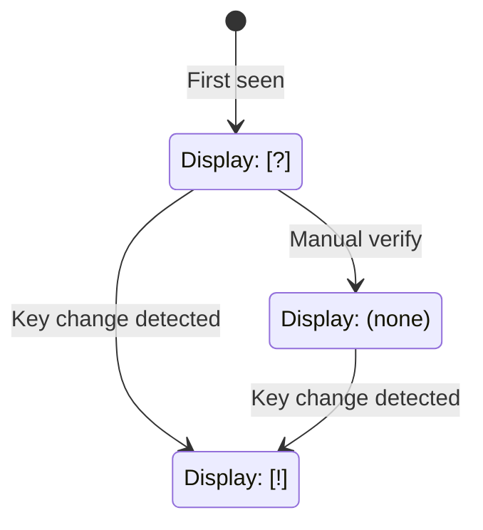

# TOFU Fingerprint Verification

## Overview

RFC 9420 requires an Authentication Service (AS) to let group members authenticate each other's credentials. In Conclave, the server-side AS provides the initial identity binding (username → user ID → signing key fingerprint), and client-side TOFU verification ensures continuity of that binding after first contact.

Conclave uses a **Trust On First Use (TOFU)** model — similar to SSH `known_hosts` — to let users detect signing key changes after initial contact. Each user's MLS signing public key is hashed to produce a fingerprint. Clients store the first-seen fingerprint for each user and flag any subsequent changes.

## Fingerprint Computation

The fingerprint is the SHA-256 hash of the user's MLS signing public key, represented as a 64-character lowercase hexadecimal string:

```
fingerprint = lowercase_hex(SHA-256(signing_public_key_bytes))
```

The resulting string is exactly 64 characters (256 bits / 4 bits per hex digit).

## Fingerprint Display Format

For user-facing display, fingerprints SHOULD be formatted as **8 groups of 8 hex characters** separated by spaces:

```
a1b2c3d4 e5f6a7b8 c9d0e1f2 a3b4c5d6 e7f8a9b0 c1d2e3f4 a5b6c7d8 e9f0a1b2
```

For comparison and storage, fingerprints SHOULD be normalized by removing all whitespace and converting to lowercase.

## Fingerprint Distribution

### Upload

Clients compute their fingerprint locally and upload it to the server during key package upload (via the `signing_key_fingerprint` field in `UploadKeyPackageRequest`). This occurs:

- On **registration** (initial key package upload).
- On **login** (key package re-upload).
- On **account reset** (new identity, new key packages).

### Distribution

The server stores the fingerprint in the user's record and distributes it alongside member data in:

- **`GroupMember.signing_key_fingerprint`**: Included in `ListGroupsResponse`, so clients receive fingerprints for all co-members.
- **`UserInfoResponse.signing_key_fingerprint`**: Returned by the user lookup endpoints (`GET /api/v1/users/{username}`, `GET /api/v1/users/by-id/{user_id}`, `GET /api/v1/me`).

## Local TOFU Store

Clients MUST maintain a local store of known fingerprints, tracking the first-seen fingerprint for each user. The store contains:

| Field | Type | Description |
|-------|------|-------------|
| `user_id` | integer | Primary key — the user being tracked |
| `fingerprint` | string | The stored fingerprint (64-char hex) |
| `verified` | boolean | Whether the fingerprint has been manually verified |

## Verification States

A user's fingerprint can be in one of four states:

| State | Condition | Display Indicator |
|-------|-----------|-------------------|
| **Unknown** | The server has no fingerprint for this user (e.g., legacy account, key packages not yet uploaded) | `[?]` |
| **Unverified** | The client has stored a fingerprint on first contact, but the user has not manually confirmed it | `[?]` |
| **Verified** | The user has confirmed the fingerprint out-of-band via the verify command | (none) |
| **Changed** | The server's fingerprint differs from the locally stored value | `[!]` |

### State Transitions



## Key Change Detection

When a user performs an account reset, their signing keys are regenerated and a new fingerprint is uploaded to the server. Other clients detect the fingerprint change when they next receive the user's updated member data (via `ListGroupsResponse` or `UserInfoResponse`).

A changed fingerprint triggers the `[!]` warning indicator. This alerts members to verify the new fingerprint out-of-band. Key changes are expected after `/reset` (account reset with new signing keys) but could also indicate a key substitution attack.

An `IdentityResetEvent` SSE event is sent to co-members when a user performs an external rejoin after reset, providing an additional signal.

## User Commands

Clients SHOULD provide the following commands for fingerprint verification:

| Command | Description |
|---------|-------------|
| `/whois [username]` | Display a user's fingerprint and verification status. With no argument, displays the current user's own fingerprint. |
| `/verify <username> <fingerprint>` | Manually verify a user's fingerprint. The client checks that the provided fingerprint matches the server's current fingerprint for that user, then stores it as verified. If the fingerprint does not match, the command is rejected. |
| `/unverify <username>` | Remove verification status for a user, resetting them to Unverified (TOFU) state. |
| `/trusted` | List all users in the local TOFU store with their fingerprints and verification status. |

## Security Model

### Protection Provided

- **Post-first-contact key substitution**: After the initial fingerprint is stored, any change — whether from a compromised server, man-in-the-middle, or legitimate key reset — is detected and flagged with `[!]`.

### Limitations

- **No protection against first-contact attacks**: If the server is compromised during the initial key exchange, it could substitute a different key. This is the inherent limitation of TOFU.
- **Server-mediated distribution**: The server distributes fingerprints. A compromised server could substitute fingerprints for new contacts before the client has stored them.

### Stronger Assurance

Users can use `/verify` to confirm fingerprints through a trusted out-of-band channel (in person, phone call, verified messaging, etc.). This eliminates the first-contact vulnerability for verified users, upgrading from TOFU trust to verified trust.

The TOFU model is a practical trade-off between usability (no PKI or certificate authority required) and security (detects key changes after initial contact). For communities requiring stronger guarantees, out-of-band `/verify` provides a path to full fingerprint verification.
